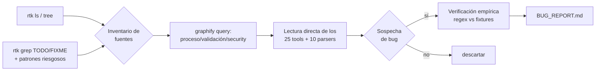
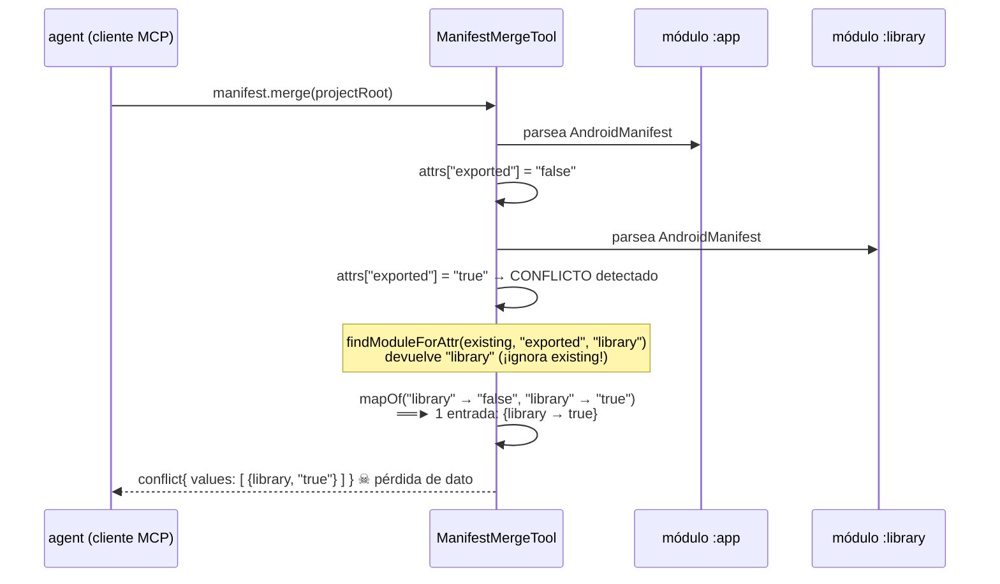
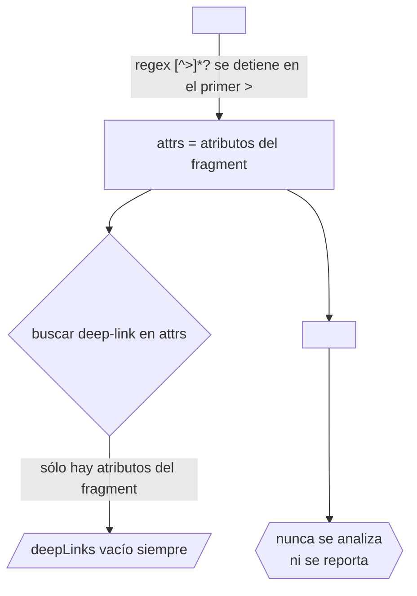
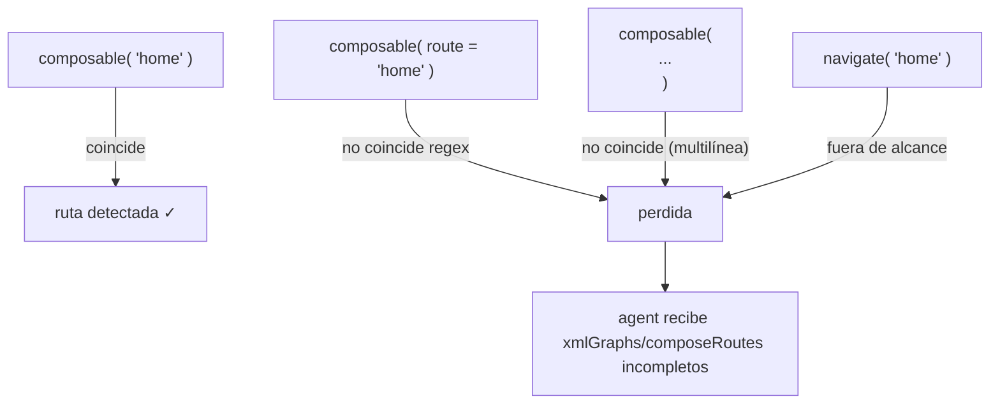
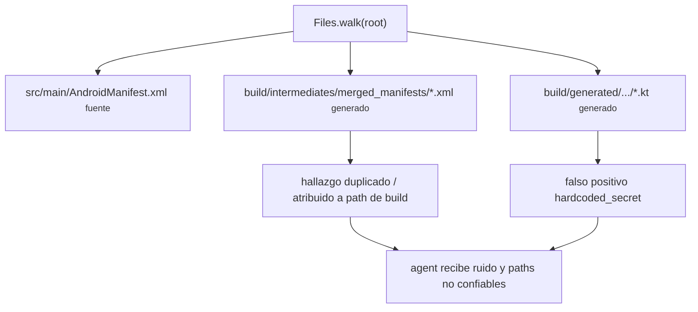
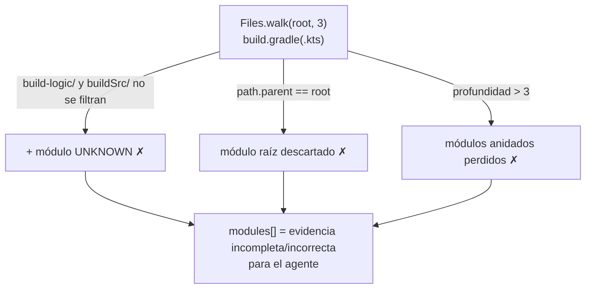
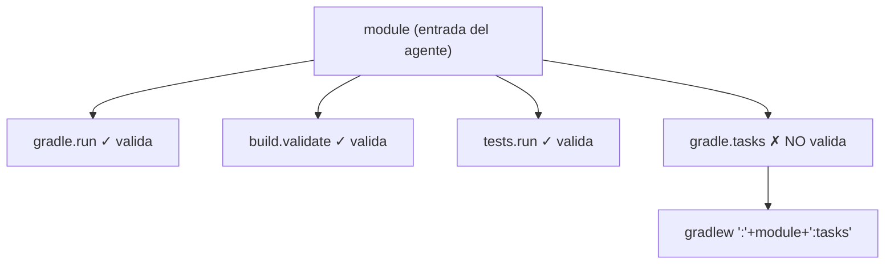
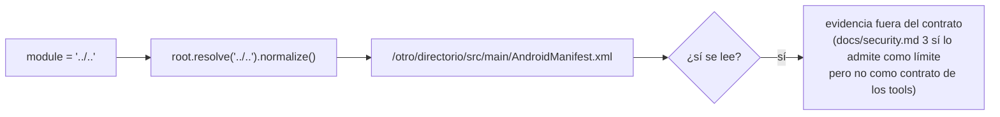
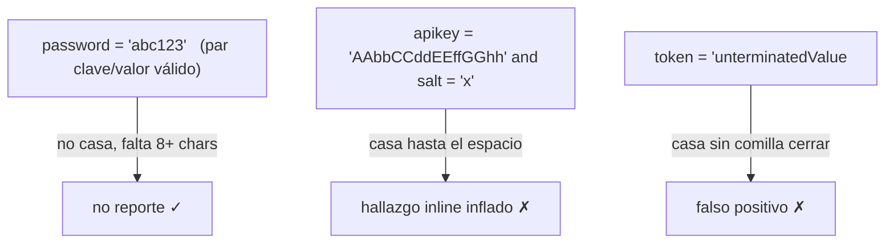
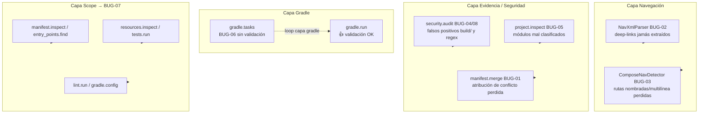

# BUG_REPORT — AndroidCorporateMCP

**Fecha:** 2026-08-27
**Rama inspeccionada:** `develop`
**Commits revisados:** `HEAD` (`d24f16f`, merge `release → develop`) y diffs con `origin/main`, `origin/release`, `origin/develop`.
**Herramientas de inspección:** `rtk ls/tree`, `rtk grep`, `rtk git diff`, `graphify query`, lectura directa de fuentes, y verificación empírica de los parsers (regex) contra los fixtures reales de `src/test/resources`.

---

## 1. Resumen ejecutivo

Se inspeccionaron los 25 tools, 10 parsers y el núcleo de proceso/validación de `src/main/kotlin`. El proyecto compila y los tests existentes pasan (`./gradlew test` ✓), **pero la cobertura no alcanza a los bugs encontrados**.

Se confirmaron **8 bugs / defectos reales** (no son "limitaciones documentadas"):

| ID | Severidad | Área | Bug |
|----|-----------|------|-----|
| BUG-01 | 🔴 Alta | `manifest.merge` | `findModuleForAttr` pierde la atribución de módulo en conflictos: `values` colapsa a 1 sola entrada. |
| BUG-02 | 🔴 Alta | `navigation.graph` | `NavXmlParser` nunca extrae deep links: las dos regex son código muerto (confirmado con fixture). |
| BUG-03 | 🟠 Media | `navigation.graph` | `ComposeNavDetector` no detecta `composable(route = "…")`, llamadas multilínea ni `navigate("…")`. |
| BUG-04 | 🟠 Media | `security.audit` | Escanea `build/` y dirs generados → falsos positivos/hallazgos duplicados en manifiestos merged y código generado. |
| BUG-05 | 🟠 Media | `project.inspect` | Incluye `build-logic/`/`buildSrc/` como módulos UNKNOWN y omite el módulo raíz y los módulos con profundidad > 3. |
| BUG-06 | 🟠 Media | `gradle.tasks` | No valida la tarea derivada del parámetro `module` (inconsistente con `gradle.run`/`build.validate`). |
| BUG-07 | 🟡 Baja | Varios tools | Parámetro `module` sin sanitizar → `root.resolve(module)` permite escapar del `projectRoot` con `../`. |
| BUG-08 | 🟡 Baja | `security.audit` | Regex de secretos no exige la comilla de cierre del valor → falsos positivos. |

Además hay deuda técnica menor documentada al final (BUG-09…BUG-12).

---

## 1b. Estado de corrección (actualización 2026-08-29)

Los 8 bugs confirmados quedaron corregidos y con test de regresión. Suite completa en verde (`./gradlew test` ✓).

| ID | Estado | Fix | Test de regresión |
|----|--------|-----|-------------------|
| BUG-01 | ✅ Corregido | `ManifestMergeTool` reescrito rastreando módulo-origen por atributo (`AttrValue(value, origin)`); eliminado `findModuleForAttr`. Además `findManifests` excluye dirs generados (BUG-13). | `ManifestMergeToolTest` `reports module origin for each conflicting attribute value` |
| BUG-02 | ✅ Corregido | `NavXmlParser` reescrito con DOM (`DocumentBuilderFactory`), deep links `android:uri` y `app:uri`, actions, arguments, `isStartDestination` con id normalizado. | `NavXmlParserRegressionTest` |
| BUG-03 | ✅ Corregido | `ComposeNavDetector` acepta `route = "…"`, llamadas multilínea, comillas simples y `navigate("…")`/`navigate(route = "…")`, con línea real. | `ComposeNavDetectorRegressionTest` |
| BUG-04 | ✅ Corregido | `SecurityAuditTool` filtra `build/` etc. en `checkManifest` y `checkHardcodedSecrets` vía `Path.isUnderExcludedDir`. | `SecurityAuditToolTest` `ignores generated manifests under build directories` |
| BUG-05 | ✅ Corregido | `ProjectInspectTool` excluye `build-logic`/`buildSrc`, profundidad 6, incluye build file raíz si aplica plugin Android sin `apply false`. | `ProjectInspectToolTest` (3 tests nuevos) |
| BUG-06 | ✅ Corregido | `GradleTasksTool` valida `target` con `GradleCommandValidator.validateTaskName` antes del wrapper → `invalid_module`. | `GradleTasksToolIntegrationTest` `reports invalid_module before looking for a wrapper` |
| BUG-07 | ✅ Corregido | Helper `ProjectPaths.resolveModuleOrNull` (valida `startsWith(root)`) aplicado en los 6 tools → `invalid_module`. | `ManifestInspectToolTest` `rejects module paths that escape the project root` + `ProjectPathsTest` |
| BUG-08 | ✅ Corregido | Regex de secretos exige comilla de cierre (sencilla y doble), `IGNORE_CASE`, valor ≥ 8 chars. | `SecurityAuditToolTest` `only flags hardcoded secrets with a closing quote` |

Verificación: `./gradlew test` → BUILD SUCCESSFUL (suite completa, incluidos los tests nuevos de regresión).

---

## 2. Metodología



**Conclusiones verificadas empíricamente:**
- `NavXmlParser` con el fixture real `nav_graph.xml` (que contiene `<deep-link android:uri="corporate://login"/>`) → `deepLinks` siempre `[]`.
- `GradleCommandValidator` sí restringe tareas/flags en `gradle.run` (pero `gradle.tasks` no valida el fragmento de módulo).
- `mapOf(a to x, a to y)` en Kotlin retiene una sola clave → confirmado el colapso en `manifest.merge`.

---

## 3. Detalle de bugs

### BUG-01 — `manifest.merge` pierde la atribución de conflictos

**Archivo:** `src/main/kotlin/dev/normansanchez/androidmcp/tools/ManifestMergeTool.kt`
**Líneas:** `findModuleForAttr` (139-145), uso en `detectConflicts` (113-127).

`findModuleForAttr(existing, targetAttr, fallbackModule)` **ignora sus dos primeros argumentos** y siempre devuelve `fallbackModule` (el módulo que se está procesando ahora). Al construir el mapa del conflicto:

```kotlin
values = mapOf(
    findModuleForAttr(existing, attrName, module) to existingValue, // -> siempre "module"
    module to attrValue                                              // -> misma clave
)
```

`mapOf` con claves repetidas deja **una sola entrada** (la última gana). Consecuencias:

1. `conflicts[].values` tiene siempre **1 elemento**, no los 2 que promete el contrato en `docs/tools.md`.
2. Se pierde el **valor anterior** (`existingValue`) y el **módulo** que lo declaró.
3. El agente que consume `manifest.merge` recibe un conflicto sin la información mínima para resolverlo.



**Contrato violado:** `docs/tools.md:531` — "flags where two modules *declare different values* for the same component attribute".

**Fix:** rastrear el módulo que aporta cada valor (por ejemplo, un `Map<attrName, MóduloOrigen>` por componente) y usar esa clave al armar `values`.

---

### BUG-02 — `navigation.graph` nunca reporta deep links

**Archivo:** `src/main/kotlin/dev/normansanchez/androidmcp/navigation/NavXmlParser.kt`
**Líneas:** `nodePattern` (49-52), extracción de deep links (59-69).

`nodePattern = <(fragment|activity)\b([^>]*?)/?>` captura `attrs` solo hasta el **primer `>`** del tag de apertura del fragment. Los `<deep-link>` son **nodos hijos**, que viven después de ese `>` → **jamás aterrizan en `attrs`**. Ambas regex de deep-link (`deepLinks` self-closing y `deepLinkBlock`) operan sobre `attrs`, por lo que son **código muerto**.



**Verificación empírica** (fixture `nav_graph.xml`):

```
dest: @+id/homeFragment  | deep-links found: []
dest: @+id/loginFragment | deep-links found: []
```

Aunque el XML contiene `corporate://login`. El campo `deepLinks[]` del contrato (`docs/tools.md:488`) queda **siempre vacío**. El test `NavigationGraphToolTest` solo comprueba `hasXml || hasCompose`, así que nunca lo detectó.

**Fix:** usar un parser DOM/StAX real (como `ManifestInspectTool`) o dos regex en dos pasadas: primero extraer el bloque de cada `fragment`/`activity` (con `</fragment>` como cierre), y luego buscar `<deep-link[^>]*android:uri="([^"]+)"` dentro del bloque.

---

### BUG-03 — `ComposeNavDetector` sub-reporta rutas de Compose Navigation

**Archivo:** `src/main/kotlin/dev/normansanchez/androidmcp/navigation/ComposeNavDetector.kt`
**Línea:** `COMPOSABLE_PATTERN` (20), usado en `detect` (28).

`composable\(\s*"([^"]+)"` exige un **literal de string inmediatamente después del paréntesis**, en la **misma línea**. Patrones comunes que se pierden:

```kotlin
composable(
    route = "detail/{id}",          // argumento nombrado ❌
)
composable(route = "home")          // argumento nombrado ❌
navController.navigate("detail/42") // navigate(...) nunca se inspecciona ❌
```



**Impacto:** `navigation.graph` subestima los destinos Compose y el agente confía en una lista incompleta de rutas.

**Fix:** aceptar `route = "…"` (`composable\((?:\s*route\s*=\s*)?["'`), soportar multilínea aplicando la búsqueda sobre el texto completo (no por línea) y opcionalmente capturar `navigate("…")`.

---

### BUG-04 — `security.audit` escanea `build/` y código generado

**Archivo:** `src/main/kotlin/dev/normansanchez/androidmcp/tools/SecurityAuditTool.kt`
**Líneas:** `checkManifest` `Files.walk(root, 8)` (68), `checkHardcodedSecrets` `Files.walk(root, 8)` (138).

Ninguno excluye `build/`, `.gradle/`, `build/generated`, `intermediates`. Resultado:

- **`checkManifest`:** reporta `android:exported` / `allowBackup` de los **manifiestos merged generados por AGP** en `build/intermediates/merged_manifests/`, que incluyen componentes de librerías de terceros, atribuidos además a un path dentro de `build/` que no es fuente de decisión.
- **`checkHardcodedSecrets`:** escanea `.kt/.java/.xml` generados (`build/generated/…`) → duplicados y falsos positivos sobre código que no escribió el equipo.



**Fix:** reutilizar la misma exclusión de `KotlinSourceScanner.EXCLUDED_DIR_NAMES` (o excluir `build`, `.gradle`, `buildSrc` capturado, etc.) en todos los `Files.walk` de los tools de evidence.

---

### BUG-05 — `project.inspect` descubre "módulos" que no son módulos y omite los que sí son

**Archivo:** `src/main/kotlin/dev/normansanchez/androidmcp/tools/ProjectInspectTool.kt`
**Líneas:** `findModules` (91-110), `containsApplicationPlugin`/`containsLibraryPlugin` (139-155).

- `Files.walk(root, 3)` **incluye** `build-logic/build.gradle.kts` y `buildSrc/build.gradle.kts` como módulos `UNKNOWN` (contaminan `modules[]`).
- **Omite** el `build.gradle.kts` en la raíz (`path.parent != root`), es decir, un repo de **módulo único** reporta 0 módulos.
- **Omite** módulos anidados a profundidad > 3.
- La detección de plugin se hace por `content.contains(...)`, que falla con variantes: `alias(libs.plugins.android.application) apply false`, `id "com.android.application" version "x"`, etc.



**Fix:** ignorar `build-logic`, `buildSrc`, `.gradle`, `build`; incluir el build file raíz cuando aplique el plugin de aplicación; ampliar profundidad configurable y usar detección de plugin más robusta para la clasificación.

---

### BUG-06 — `gradle.tasks` no valida el fragmento de módulo (inconsistente con el resto)

**Archivo:** `src/main/kotlin/dev/normansanchez/androidmcp/tools/GradleTasksTool.kt`
**Líneas:** 36-41.

Cada tool que deriva una tarea Gradle de la entrada del usuario la pasa por `GradleCommandValidator.validateTaskName` (`gradle.run`, `build.validate`, `dependencies.inspect`, `tests.run`, `lint.run`, `staticAnalysis.run`). **`gradle.tasks` no:**

```kotlin
val target = module?.removePrefix(":")
val command = listOf(wrapper, ":$target:tasks", "--all")  // sin validateTaskName
```

`module = "foo --offline"` o `module = "../.."` produce un argumento de tarea inválido o, peor, una tarea inesperada (por ej. `:..:tasks` apunta fuera del proyecto). No hay inyección de shell (usamos `ProcessBuilder`), pero el comportamiento es inconsistente y rompe la política de "validar siempre la tarea derivada".



**Fix:** aplicar `validateTaskName(":$target:tasks")` y responder `status=invalid_module` cuando falle.

---

### BUG-07 — Parámetro `module` sin sanitizar → escape del `projectRoot`

**Archivos (resolución `root.resolve(module)` / `root.resolve(module.removePrefix(":"))`):**
- `ManifestInspectTool.kt:20`
- `EntryPointsFindTool.kt:34`
- `ResourcesInspectTool.kt:43`
- `TestsRunTool.kt:45`
- `LintRunTool.kt:38`
- `GradleConfigTool.kt:26`

Con `module = "../.."` (o una ruta absoluta), `root.resolve(...).normalize()` sale del árbol del proyecto y los tools leen `AndroidManifest.xml` / `build/reports` / `libs.versions.toml` de **cualquier directorio del sistema** accesible por el usuario del proceso.



`docs/security.md` ya reconoce "no path confinement" como modelo de confianza, por lo que **no es una vulnerabilidad crítica**, pero rompe el *scope* que el README promete ("deterministic inspection of a project root") y debería al menos **normalizar y verificar `startsWith(root)`**.

**Fix:** función helper `resolveModule(root, module): Path?` que: `val resolved = root.resolve(module).normalize(); return resolved.takeIf { it.startsWith(root.normalize()) }`. Aplicarla en los 6 tools.

---

### BUG-08 — Regex de secretos sin delimitador de cierre

**Archivo:** `src/main/kotlin/dev/normansanchez/androidmcp/tools/SecurityAuditTool.kt`
**Línea:** 134.

```kotlin
Regex("""(?:api[_-]?key|secret|password|token)\s*=\s*"[A-Za-z0-9+/=]{8,}""", IGNORE_CASE)
```

No requiere la `"` de cierre del valor. Además `[A-Za-z0-9+/=]` admite dígitos y letras, por lo que en `password = "abc123" and token = "xyz"` puede casar de más o hacer match sobre valores no terminados. **Falsos positivos** en líneas con varias asignaciones o con secretos no-cerrados.



**Fix:** `\s*=\s*"[A-Za-z0-9+/=._-]{8,}"` (cerrar la comilla) y opcionalmente restringir caracteres a base64 estricto.

---

## 4. Deuda técnica menor (no crítico)

| ID | Archivo | Nota |
|----|---------|------|
| BUG-09 | `tools/StaticAnalysisTool.kt:16-17` | `KTLINT_TASKS` y `KOVER_TASKS` declarados y nunca usados; `requestedTools` ignora tools desconocidos con `continue` silencioso. |
| BUG-10 | `staticanalysis/DetektParser.kt:17-20` | Regex extremadamente frágil y **no usado por ningún tool** (código muerto). `staticAnalysis.run` solo devuelve exit code. |
| BUG-11 | `server/Main.kt:150-156` | `serverInfo.name = "lattice-android-mcp-server"` y client `"lattice-android-mcp-test-client"` — nombre heredado ("Lattice") que no coincide con el proyecto. |
| BUG-12 | `tools/ResourcesInspectTool.kt:82` | Rama `type in DPI_BUCKETS` inalcanzable (siempre `qualifier`): código muerto. |
| BUG-13 | `tools/ProjectInspectTool.kt` (`GradleTasksTool`. classes reuse) | `Files.walk` sin exclusión de `.gradle`, `build` en `ManifestMergeTool.findManifests` (puede agregar manifest merged de librerías). |

---

## 5. Mapa de impacto



---

## 6. Plan de acción propuesto

Priorizado por **impacto del dato** (el valor real del servidor es "evidencia determinística") sobre inversión.

| # | Acción | Bugs | Esfuerzo |
|---|--------|------|----------|
| 1 | **Reescribir `NavXmlParser` con DOM real** (como `ManifestInspectTool`) y añadir test que aserte `deepLinks = ["corporate://login"]` en el fixture existente. | BUG-02 | S |
| 2 | **Corregir `findModuleForAttr`/`detectConflicts`** para rastrear módulo-origen por atributo; test que verifique `values` con 2 entradas. | BUG-01 | S |
| 3 | **Añadir test de regresión** `ComposeNavDetector` (nombre + multilínea + `navigate`) y ampliar `COMPOSABLE_PATTERN`. | BUG-03 | S |
| 4 | **Excluir `build`/`.gradle`/`build/generated`/`intermediates`** de todos los `Files.walk` de evidencia (helper compartido). | BUG-04, BUG-13 | S |
| 5 | **Sanear `projectRoot`/`module` con `resolveModule`** que valide `startsWith(root)`; aplicarlo en los 6 tools. | BUG-07 | S |
| 6 | **Excluir `build-logic`/`buildSrc` y módulo raíz** en `project.inspect`; ampliar profundidad. | BUG-05 | M |
| 7 | **Validar tarea derivada en `gradle.tasks`** (`validateTaskName`), consistente con el resto. | BUG-06 | XS |
| 8 | **Cerrar la comilla en la regex de secretos**; añadir casos de test. | BUG-08 | XS |
| 9 | **Salida técnica:** borrar constantes muertas (`StaticAnalysisTool`, `ResourcesInspectTool`), decidir si `DetektParser` se integra a `staticAnalysis.run` o se elimina, renombrar `serverInfo.name` a `android-corporate-mcp-server`. | BUG-09…12 | M |

> **Gateway de verificación:** cada fix debe venir acompañado de un test que falle antes del cambio y pase después (los bugs BUG-01/02/03 son perfectos candidatos a TDD: hoy hay fixtures que *tendrían* que cubrirlos y no lo hacen).

**Recomendación de proceso:** los 3 bugs "de contrato roto" (BUG-01, 02, 05) invalidan la promesa central del producto ("evidence, never opinion"). Sugiero priorizarlos en el siguiente sprint y ejecutar `./gradlew test --rerun-tasks` + `graphify update .` tras cada cambio.

---

*Reporte generado con `rtk` + `graphify query` + revisión de fuentes. Ningún hallazgo es una "limitación ya documentada" en `docs/limitations.md`.*