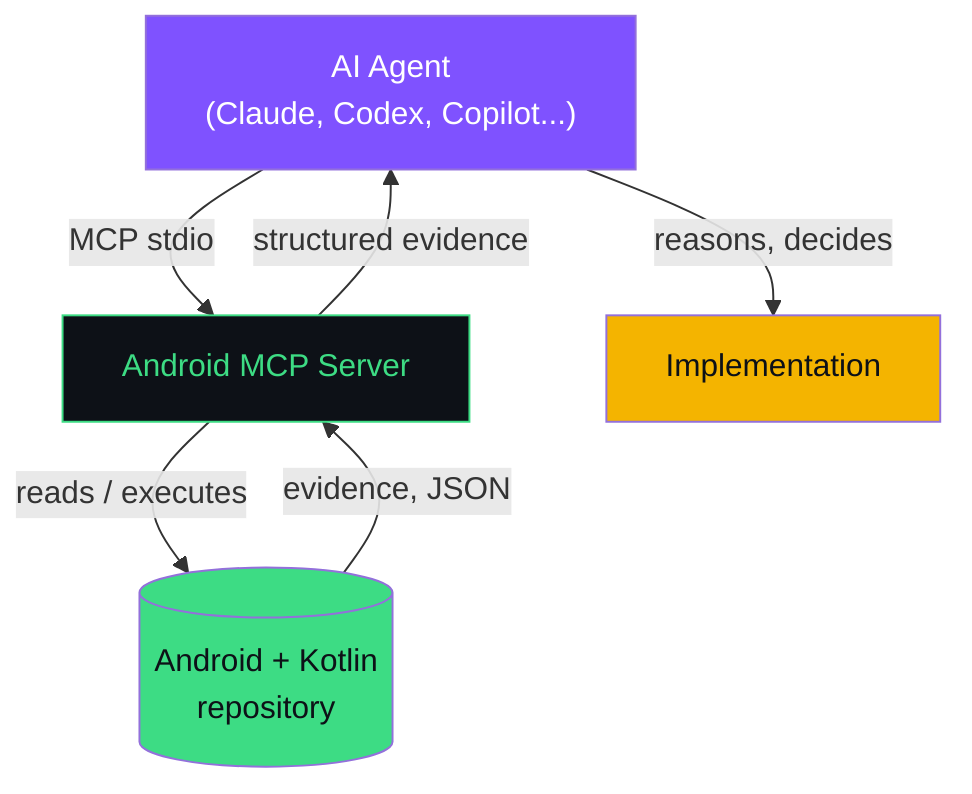

<p align="center">
  
</p>

<p align="center">
  <a href="https://modelcontextprotocol.io/"></a>
  
  
  
</p>

<p align="center">
  <a href="https://normansanchez.dev">normansanchez.dev</a> ·
  <a href="mailto:contact@normansanchez.dev">contact@normansanchez.dev</a>
</p>

---

Deterministic [Model Context Protocol](https://modelcontextprotocol.io/) server that gives AI agents **structured, verifiable evidence** about a real Android/Kotlin/Gradle repository — instead of letting them guess.

> **The MCP observes. The agent reasons.**

## The problem

An agent may know what a `ViewModel` or a Gradle convention plugin generally *is*, but it can't safely assume which architecture *this* repository actually uses, which plugins are applied, or whether a proposed change compiles — without either reading the whole repo itself or guessing. This server closes that gap: 26 tools inspect the real project (source, manifests, Gradle output, compiler-parsed symbols) and return what was actually found — never an inferred opinion.

## Philosophy

Every tool returns evidence: a file path, a line, a parsed value, a process exit code. Nothing is generated, summarized, or recommended by the server itself — that reasoning stays with the connected agent. See [docs/architecture.md](docs/architecture.md) for how that boundary is enforced end to end.

## Quick start

```bash
npm install -g android-corporate-mcp
```

Add to your MCP client config (Claude Code `.mcp.json` shown; see [docs/configuration.md](docs/configuration.md) for every supported client):

```json
{
  "mcpServers": {
    "android-mcp": {
      "command": "android-corporate-mcp"
    }
  }
}
```

Restart your client, open an Android/Gradle repository, and call a tool:

```json
// tools/call project.inspect { "projectRoot": "/absolute/path/to/your-android-project" }
{
  "status": "success",
  "modules": ["app", "core:network", "feature:home"],
  "settingsFile": "settings.gradle.kts"
}
```

Full walkthrough: [docs/getting-started.md](docs/getting-started.md).

## What it can do

26 tools across project discovery, Kotlin symbol analysis, Gradle execution, build validation, security auditing, and flow detection — full contract for each in [docs/tools.md](docs/tools.md).

| Category | Examples |
|---|---|
| Project & Kotlin | `project.inspect`, `manifest.inspect`, `symbol.find`, `symbol.references`, `module.graph` |
| Gradle execution | `gradle.tasks`, `gradle.run`, `tests.run`, `lint.run`, `dependencies.inspect` |
| Architecture & build | `architecture.detect`, `build.validate`, `staticAnalysis.run` |
| Android deep inspection | `navigation.graph`, `resource.references`, `manifest.merge` |
| Security | `proguard.inspect`, `security.audit` |

## Compatibility

Speaks standard MCP stdio — no client-specific code. Verified directly on macOS (Apple Silicon) with the local build/JAR/npm launcher; other MCP clients and platforms are expected-compatible but not yet individually confirmed. Full, honestly-graded matrix (tested vs. expected vs. untested) in [docs/compatibility.md](docs/compatibility.md).

## Architecture



One process, local stdio transport, no daemon, no persisted state between calls. Full lifecycle, handshake, and a real end-to-end request walkthrough: [docs/architecture.md](docs/architecture.md).

## Security & local-first

The server runs with the same filesystem and process permissions as the user who launches it, and makes no outbound network call in any of its 26 tools — everything stays on your machine, over local stdio. `gradle.run` executes Gradle tasks the caller names (validated only for syntax, not restricted to a curated safe list), which is the one tool worth restricting if you connect this server to an agent you don't fully trust. Full breakdown, with no unverifiable "100% secure" claims: [docs/security.md](docs/security.md).

## Documentation

[Getting started](docs/getting-started.md) · [Architecture](docs/architecture.md) · [Tools](docs/tools.md) · [Compatibility](docs/compatibility.md) · [Configuration](docs/configuration.md) · [Security](docs/security.md) · [Limitations](docs/limitations.md) · [Development](docs/development.md) · [Contributing](docs/contributing.md) · [Troubleshooting](docs/troubleshooting.md)

## Contributing

See [docs/contributing.md](docs/contributing.md) for the real branching model, PR expectations, and how to add a new tool ([docs/development.md](docs/development.md)).

## License

`package.json` declares MIT, but no `LICENSE` file exists in this repository yet — treat licensing as unresolved until that's added (tracked in [docs/contributing.md](docs/contributing.md)).

---

<p align="center">
  Built by <a href="https://normansanchez.dev">Norman Sánchez</a><br/>
  <a href="mailto:contact@normansanchez.dev">contact@normansanchez.dev</a>
</p>
