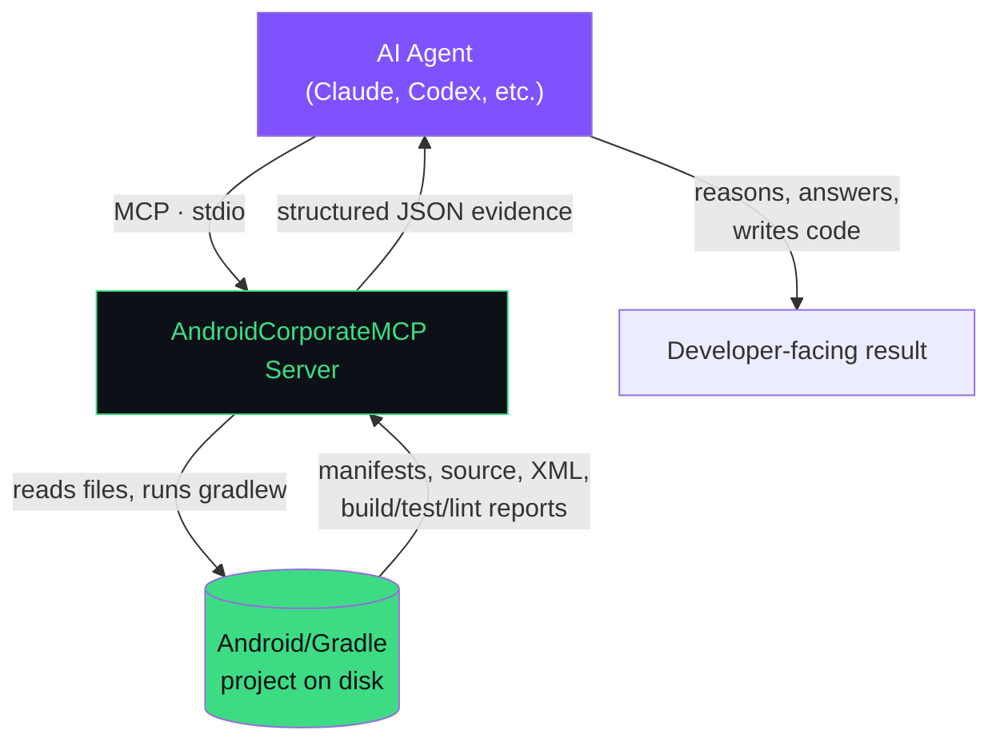
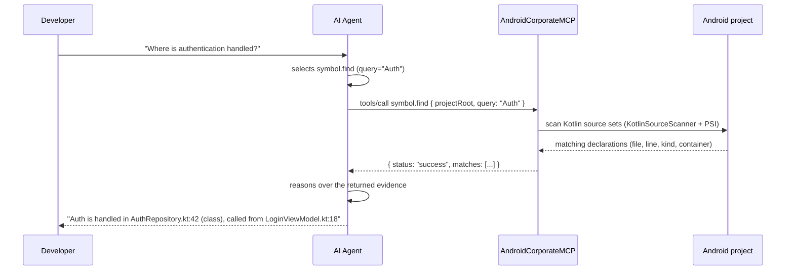

# Architecture

## The boundary

The server's responsibility ends at "structured JSON evidence." It does not draft code, decide architecture, or interpret whether evidence is *good*. That is true of every one of the 25 registered tools (`src/main/kotlin/dev/normansanchez/androidmcp/server/Main.kt`): each one returns a `JsonObject` built from something actually observed — a parsed file, a Gradle process's stdout, an XML tree — never a generated opinion.

> **"The MCP found X" is not the same claim as "the agent concluded Y."** Every tool response in this codebase is evidence (a file path, a line number, a parsed value). What that evidence *means* for the task at hand is decided entirely on the client/agent side, outside this repository.

## Process model

The server is a single JVM process (`dev.normansanchez.androidmcp.server.MainKt`, the `application.mainClass` in `build.gradle.kts`). It does not fork worker processes for its own logic — the only child processes it ever spawns are `gradlew` invocations, and only from the seven tools that need one (see [tools.md](tools.md)). Everything else runs in-process: file reads, XML parsing (`javax.xml.parsers.DocumentBuilderFactory`), and Kotlin source parsing via the Kotlin compiler's PSI layer (`org.jetbrains.kotlin:kotlin-compiler-embeddable`, wrapped in `KotlinPsiEngine`/`KotlinSourceScanner`).

## Lifecycle and stdio handshake

`main()` in `server/Main.kt` does exactly this, in order:

1. **Reclaims stdout for the protocol.** `System.setOut(System.err)` redirects the JVM's default stdout (used by any library that logs via `println`/`System.out`) to stderr, and a separate `FileOutputStream(FileDescriptor.out)` is captured *before* that redirect to use as the actual MCP transport channel. This is why library logging (SLF4J, kotlin-logging) never corrupts the protocol stream — it's structurally impossible for it to reach the same file descriptor the transport uses. Verified directly: launching the server and sending SIGINT after startup produces zero bytes on stdout while SLF4J/kotlin-logging output lands entirely on stderr.
2. **Builds the `Server`** with `serverInfo = Implementation(name = "lattice-android-mcp-server", version = "1.0.0")` and `ServerCapabilities(tools = Tools(listChanged = true))` — the server advertises only the `tools` capability. No `resources` or `prompts` capability is registered.

   > The server-info name still reads `lattice-android-mcp-server` in the current source (`server/Main.kt:151`) — a leftover from an internal project name, unrelated to the public `android-corporate-mcp` npm package or `AndroidMasterMCP` Gradle project name. It's cosmetic (it only appears in the MCP handshake's `Implementation.name` field, which most clients don't surface to the user) but worth knowing if you inspect the raw handshake. The server-info `version` (`1.0.0`) is also independent of the Gradle project version (`0.1.0` at the time of writing) and the npm package version — nothing in this codebase keeps those three numbers in sync.

3. **Registers all 25 tools** via a shared `Server.register(name, description, properties, required, handler)` helper. Each registration wraps its handler in a `try/catch`: any exception becomes a normal MCP tool error response (`isError = true`, `{"status": "error", "error": <message>}`) rather than crashing the session.
4. **Wires up `StdioServerTransport`**, reading from `System.in` and writing to the reclaimed stdout descriptor.
5. **Calls `mcpServer.createSession(transport)`**, then `awaitCancellation()` — the process blocks forever, handling one client session over stdio until the process is killed or stdin closes.

There is no HTTP/SSE transport wired up anywhere in this codebase — stdio is the only supported transport today, regardless of what a particular distribution channel (npm, Docker) makes it look like.

## Tool discovery and invocation

MCP tool discovery is handled entirely by the underlying `io.modelcontextprotocol:kotlin-sdk-server` library once tools are registered — the server doesn't implement its own `tools/list` handler. Each tool's `inputSchema` (a JSON Schema built from the `properties`/`required` passed to `register`) is what a client uses to know what arguments a tool accepts; see [tools.md](tools.md) for the human-readable version of every schema currently registered.

On `tools/call`, the SDK routes to the matching handler, which:

1. Pulls the raw `JsonObject` arguments off the request (`request.arguments`).
2. Extracts individual fields with small typed helpers (`argString`, `argInt`, `argBool`, `argList`) that return `null`/defaults rather than throwing on missing or wrong-typed fields.
3. Calls the corresponding `*Tool.execute(...)` object function, which does the actual filesystem/process work and returns a `JsonObject`.
4. Wraps the result as `CallToolResult(content = [TextContent(text = <json>)])` — MCP responses in this server are always a single `TextContent` block containing the tool's JSON payload as a string, never a native JSON content type.

## Execution model for process-backed tools

Seven of the 25 tools shell out to the target project's own `./gradlew` (located per-call by `GradleWrapperLocator`, which only recognizes an executable `gradlew` or a `gradlew.bat` at the project root — no fallback to a system-wide Gradle install): `gradle.tasks`, `gradle.run`, `dependencies.inspect`, `build.validate`, `staticAnalysis.run`, and conditionally `tests.run`/`lint.run` (only when called with `trigger: true` and no existing report is found).

All process execution goes through one shared component, `ProcessExecutor` (`src/main/kotlin/dev/normansanchez/androidmcp/process/ProcessExecutor.kt`):

- `ProcessBuilder(command: List<String>)` — commands are always passed as an argument list, never interpolated into a shell string. There is no shell in the execution path.
- stdout and stderr are read on separate daemon threads to avoid pipe-buffer deadlocks, then captured (truncated to 400,000 characters by default; `gradle.run` uses a tighter 40,000-character cap).
- A timeout (per-tool default, always caller-overridable via `timeoutSeconds`) triggers `process.destroyForcibly()` if exceeded; the result is reported with `"status": "timeout"` rather than a partial success.
- `gradle.run` additionally validates every task name against `GradleCommandValidator.validateTaskName` (a syntax regex — see the caveat in [tools.md](tools.md#gradlerun) and [security.md](security.md)) and every flag against a fixed `Set<String>` of eight allowed flags before building the command.

## Error propagation

Every tool follows the same shape for the failure states it can detect deterministically: an invalid/missing project root returns `"status": "invalid_project"`; a missing Gradle wrapper returns `"status": "gradle_not_available"`; a Gradle process that exits non-zero returns `"status": "gradle_error"` with the exit code and captured stderr; a timed-out process returns `"status": "timeout"`. These are not exceptions — they're normal successful MCP responses (`isError` is not set) whose JSON body tells the agent the evidence-gathering step itself failed, and why. Only truly unexpected exceptions (a bug, a permissions error the tool didn't anticipate) reach the `try/catch` in `Server.register` and become an MCP-level `isError: true` response.

## How it works: one request, end to end

A concrete example, using a question a developer might actually ask an agent connected to this server: **"Where is authentication handled in this codebase?"**

The distinction that matters: **"the MCP found `AuthRepository` declared at `AuthRepository.kt:42`" is a fact returned by `symbol.find`.** "Auth is handled there" is the agent's interpretation of that fact — the server never asserts that a symbol named `Auth*` is *the* authentication implementation, only that it exists at that location. If the search returns zero matches, that's also a fact (`"matchCount": 0`), not evidence that the project has no authentication — see [limitations.md](limitations.md) for what absence-of-evidence does and doesn't mean here.

## Repository access

The server never has an implicit "current project" — every tool takes `projectRoot` as an explicit argument (`entry_points.find`, `manifest.inspect`, `resources.inspect`, and `gradle.config` also take an optional `module`, defaulting to `"app"` where applicable). Paths are normalized and resolved to absolute before any filesystem access (`Path.of(projectRoot).normalize().toAbsolutePath()`), but nothing in this codebase enforces that `projectRoot` stays within any particular directory — the server can read (and, via `gradle.run`, execute Gradle tasks inside) anywhere the OS user running it has access to. See [security.md](security.md) for what that means in practice.
