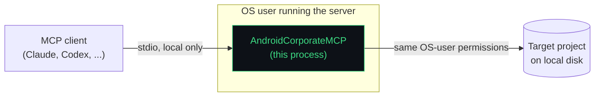

# Security & Privacy

This describes what the server actually reads, executes, and sends, based on the implementation in this repository — not a general MCP security policy. See [architecture.md](architecture.md) for how the trust boundary is structured.

## Trust boundary

The server runs with exactly the filesystem and process-execution permissions of the OS user that launched it — the same permissions a developer has when running `./gradlew <task>` by hand in that project. It does not sandbox, drop privileges, or restrict itself to a subdirectory. Nothing in `Main.kt` or any tool validates that `projectRoot` stays within an expected location.

## Network access

**No outbound network call was found in any of the 25 registered tools.** Every tool's implementation (`src/main/kotlin/dev/normansanchez/androidmcp/tools/`) does one of two things: read/parse local files, or spawn `./gradlew <task>` as a local subprocess. Neither path makes an HTTP request, opens a socket, or reaches any external service.

The project does depend on `io.ktor:ktor-client-cio` and `io.ktor:ktor-server-netty` (declared in `build.gradle.kts`), but these are transitive requirements of the MCP Kotlin SDK's client/server abstractions — this server only ever constructs a `StdioServerTransport`. Nothing in this codebase starts a Ktor HTTP server or issues a Ktor HTTP client request. If a future version of this server adds an HTTP/SSE transport or a tool that calls a remote service, that would be a real, separately-documented change to this section — it does not describe the current code.

**If Gradle itself needs the network** (e.g. `dependencies.inspect` or `gradle.run` triggering a task that resolves dependencies from Maven Central), that traffic is Gradle's own, made by the `gradlew` subprocess in the target project, using whatever repositories that project's own build configuration points at — not traffic initiated or mediated by this server.

## What the server reads

Whatever `projectRoot` (and the process's OS-user permissions) allow, which in practice means: Gradle build files, `AndroidManifest.xml` files, Kotlin/Java source, XML resources, ProGuard/R8 rule files, `gradle.properties`/`local.properties`, existing JUnit/Lint report XML, and (via `dependencies.inspect`/`gradle.tasks`) whatever `gradlew` prints to stdout/stderr. `security.audit` and `proguard.inspect` deliberately look at `local.properties` and `gradle.properties` — files that commonly hold local SDK paths, signing config paths, or (misconfigured) secrets — specifically to flag risky values, not to exfiltrate them.

## What the server processes but does not persist

Everything. There is no database, cache file, or write-back anywhere in the 25 tools. Every response is computed fresh from the filesystem/process output on each call and returned directly in the MCP response; nothing is written to disk by the server itself, and nothing is retained in memory between calls (there's no session-level state object holding prior results). Gradle itself may write build outputs (`build/` directories, caches) as a normal side effect of the tasks `gradle.run`/`build.validate`/etc. execute — that's Gradle's behavior in the target project, not state kept by this server.

## What never leaves the machine

Source code, manifests, dependency trees, test results, and every other piece of evidence a tool returns go from the local filesystem, through this local process, over local stdio, to the local MCP client. Nothing in this codebase uploads, telemetry-reports, or otherwise transmits repository contents anywhere. This is a direct consequence of "no outbound network call exists," above, not a separate guarantee layered on top.

## Command execution and the one tool that matters most

All process execution goes through `ProcessExecutor`, using `ProcessBuilder(command: List<String>)` — arguments are never interpolated into a shell string, so there is no shell-injection surface in this codebase's own command construction.

That said, **`gradle.run` executes whatever Gradle task the caller names**, subject only to a syntax check (`GradleCommandValidator.validateTaskName`, a regex — not a curated allow-list of specific safe tasks) and a genuine fixed allow-list of eight flags. Nothing stops a `gradle.run` call from running `clean`, `publish`, `assembleRelease`, or any custom task the target project defines. If you connect this server to an agent you don't fully trust with build/publish-level access to a project, `gradle.run` is the tool to restrict or avoid at the client/agent-policy level — this server does not do that restriction for you. See [tools.md#gradlerun](tools.md#gradlerun) for the exact validation code path.

`build.validate` and `staticAnalysis.run` always execute a Gradle task (there's no read-only mode), but the task names they run are hardcoded in the tool's own code (`compileDebugKotlin`, `detekt`, `ktlintCheck`, `koverHtmlReport`) — the caller cannot redirect them to an arbitrary task the way `gradle.run` allows.

## Credentials and secrets

The server does not accept, store, or transmit any credential of its own — it has no authentication mechanism, no API key, no config file with secrets. `security.audit` actively searches the *target* project for what look like hardcoded secrets (regex patterns for `api_key=`/`secret=`/`password=`/`token=` literals and AWS-style keys) and for suspicious `gradle.properties`/`local.properties` key names — this is a detection feature, and matches are returned only in the tool's own JSON response back to the calling agent over local stdio. Nothing is copied anywhere else.

## npm distribution

The published package (`android-corporate-mcp`) contains only `package.json`, `README.md`, `bin/android-corporate-mcp.js`, `bin/postinstall.js`, and the bundled `jars/*.jar` — verified directly via `npm pack --dry-run` against this exact package configuration. No `.env`, credential, cache, or IDE file is included (there's nothing in the package's `files` whitelist that could pull one in). The launcher checks that `java` is available before spawning anything, and forwards `SIGINT`/`SIGTERM`/`SIGHUP` to the JVM child process so it doesn't get orphaned.

## Repository permissions in practice

Because `gradle.run` can execute arbitrary Gradle tasks and the server enforces no path confinement, the realistic security model here is: **treat connecting this server to a repository as equivalent to giving the connected agent shell access scoped to `./gradlew <any task>` plus read access to that filesystem tree.** That is an accurate description of the current implementation, not a hypothetical worst case.

## What this document does not claim

This server has not undergone a third-party security audit. Nothing here should be read as "100% secure" or "enterprise-grade" — those are exactly the unverifiable claims this documentation project was asked to avoid. What's written above is a direct description of what the current source code does and does not do; if you need a guarantee beyond that, read the code (`src/main/kotlin/dev/normansanchez/androidmcp/`) or [open an issue](contributing.md).
